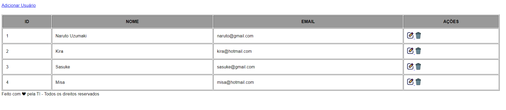

## Crud Simples com Sequelize

### Crie o SQL em seu banco de dados
CREATE TABLE `usuarios` (
  `id` int(11) NOT NULL,
  `nome` varchar(100) NOT NULL,
  `email` varchar(100) NOT NULL
) ENGINE=InnoDB DEFAULT CHARSET=utf8mb4;

### Pré-requisitos globais:
`npm i -g nodemon typescript ts-node`

### Instalação
`npm install`

### Para rodar o projeto
`npm run start-dev` abra o navegador na porta localhost:2000/usuarios

